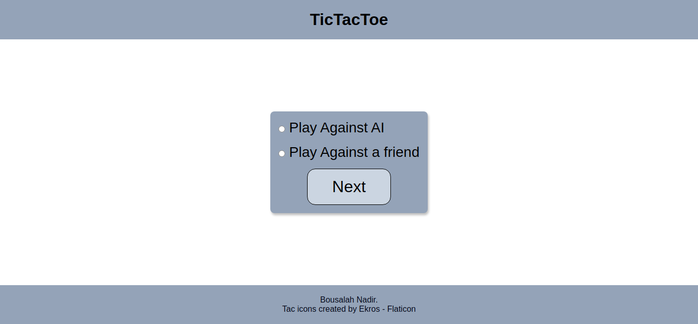
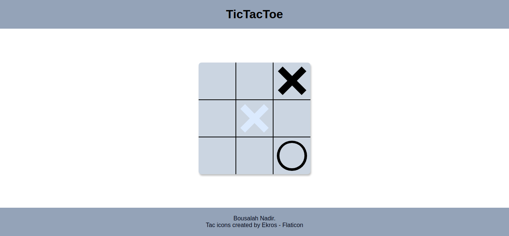
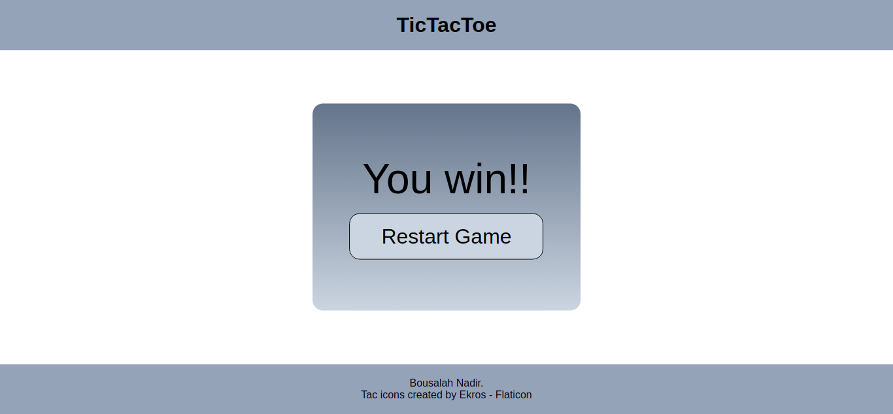

# The-OdinProject-Project-Tic-Tac-Toe

This is a solution to the Tic Tac Toe project that is part of <a href="https://www.theodinproject.com/lessons/node-path-javascript-tic-tac-toe" target="_blank">the Odin project</a>

## Table of contents

- [Overview](#overview)
  - [The challenge](#the-challenge)
  - [Screenshot](#screenshot)
  - [Links](#links)
- [My process](#my-process)
  - [Built with](#built-with)
- [Author](#author)
[Acknowledgments](#acknowledgments)

## Overview

### The challenge

Users should be able to:

- play a game of TicTacToe against a friend or AI.

### Screenshot

  ## Choosing a game type
  

  ## Gameboard
  

  ## Game Result
  

  ### Links

- Solution URL: [solution](https://github.com/Medido1/The-OdinProject-Project-Tic-Tac-Toe)
- Live Site URL: [live site](https://medido1.github.io/The-OdinProject-Project-Tic-Tac-Toe/)

## My process

### Built with

- Semantic HTML5 markup
- CSS custom properties
- Flexbox
- CSS Grid
- Vanilla javascript

## Author
- GitHub - [@Medido1](https://github.com/Medido1)

## Acknowledgments

  This project was made with some help from the youtube channel [@WebDevSimplified](https://www.youtube.com/@WebDevSimplified)